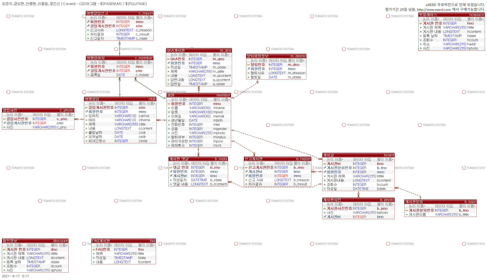
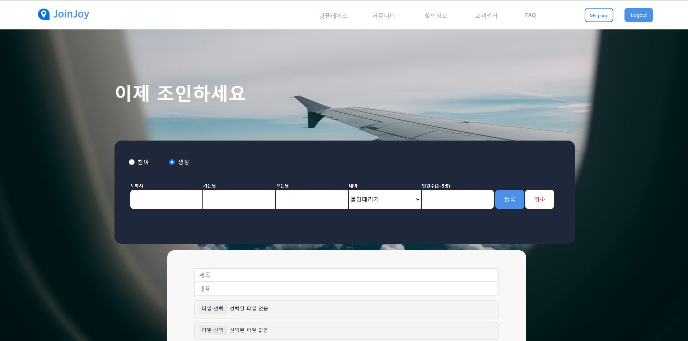
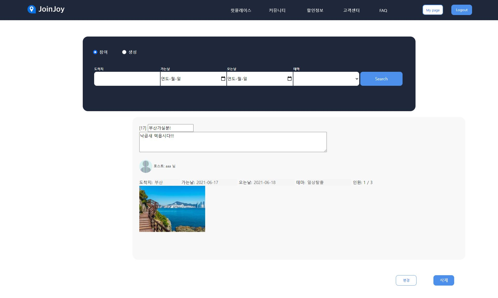
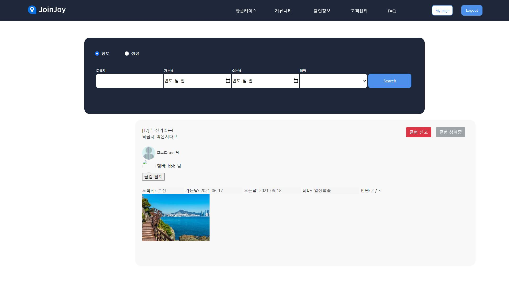

# JoinJoy(리펙토링 및 CSS 보수중)

### 여행 동반자를 찾는 웹사이트로 원하는 지역에서 원하는 테마로 팀원을 모집하여 팀원들과
### 추억을 만들 수 있는 서비스 입니다.
### 제가 담당한 서비스로는 메인기능인 클럽생성 및 관리 입니다.

## DB UML(Eclipse-exerd사용)

### 클럽참여자가 실시간으로 참여/탈퇴 또는 호스트가 강퇴를 할수 있어야 하는 점이 클럽에 대한 중점적인 기능입니다.
### 그리고 해당 클럽의 참여자만이 해당 클럽을 신고할 수 있도록 모델링 하였습니다.

## 사용기술
### Adobe XD:전반적인 사이트 구성과 UI를 제작하였으며 Zeplin을 이용하여 코드화하였습니다.
### DB:MySQL 사용하였습니다.
### Back-end
#### Java,JSP,MyBatis,SpringFramework:현재 이용자가 클럽 생성 및 가입하는 기능을 구현하였습니다.
### Front-end
#### HTML,CSS,Bootstrap,Javascript:기능을 위한 버튼과 DB에 있는 데이터들을 화면에 출력하는데 사용되었습니다.

## 화면 및 기능 설명

### 메인화면

#### 참여/생성 라디오 버튼으로 기능을 조정할 수 있습니다.

### 클럽생성화면

#### 화면과 같이 작성할 수 있으며 JQuery를 사용하여 금일부터 선태할 수 있게 설정하였습니다.

### 클럽디테일화면(호스트기준)

#### 호스트는 글 수정(제목/내용)/삭제가 가능합니다.

### 클럽디테일화면(맴버기준)

#### 해당 클럽에 가입한 멤버는 오른쪽에 클럽 참여중이라는 disable 버튼이 생성되며 해당 클럽탈퇴 및 신고가능합니다.

### 클럽신고화면(맴버기준)

#### 해당 클럽이 신고여부에 해당된다면 신고페이지로 이동하여 신고할 수 있습니다.